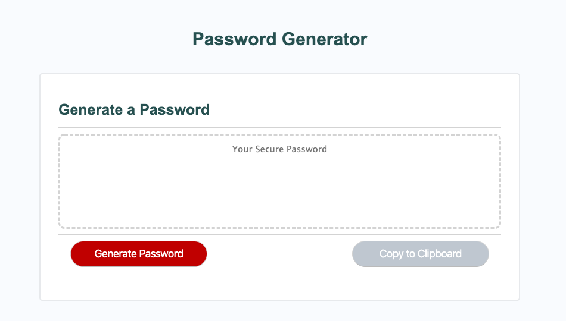
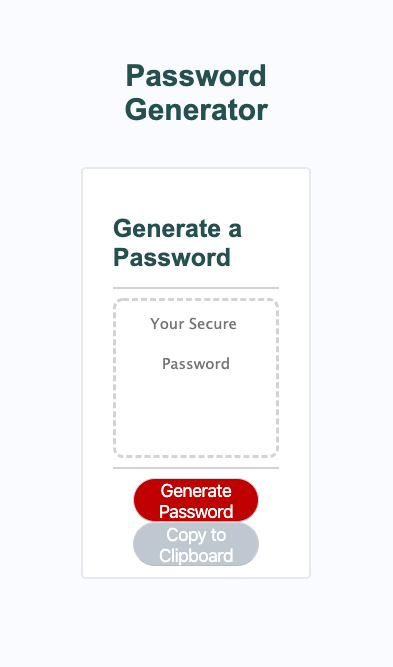

# Password-Generator

This is my random password generator!
It is coded in HTML5, CSS3, and JavaScript.

The user will be prompted to choose from the following password criteria:  
Length: must be between 8 and 128 characters  
Character type: Special characters, Numeric characters, Lowercase characters, and Uppercase characters.

Once all prompts are answered, the user will be presented with a password matching the answered prompts.  
The user also has the option to click a button to copy the password to their clipboard.

My site is published at https://zidandesirae.github.io/Password-Generator/ 

Desktop:

Mobile:

